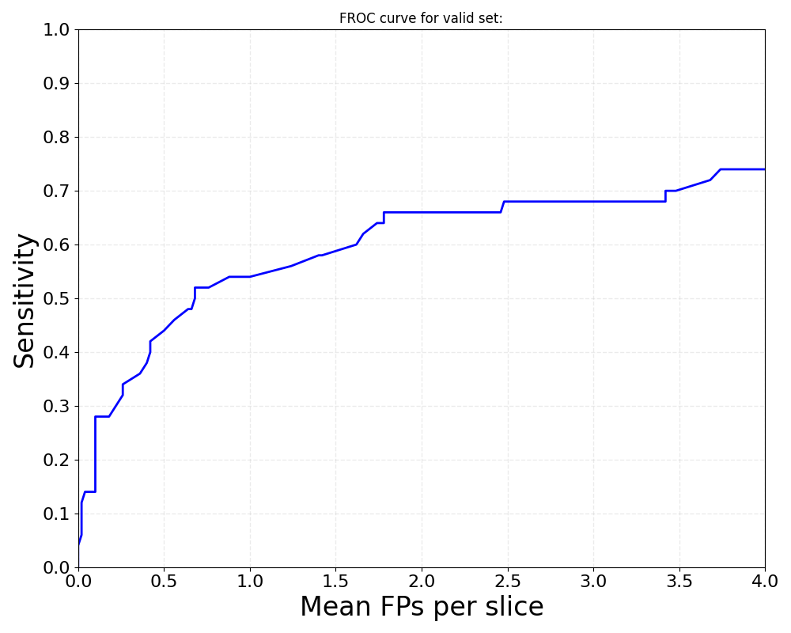
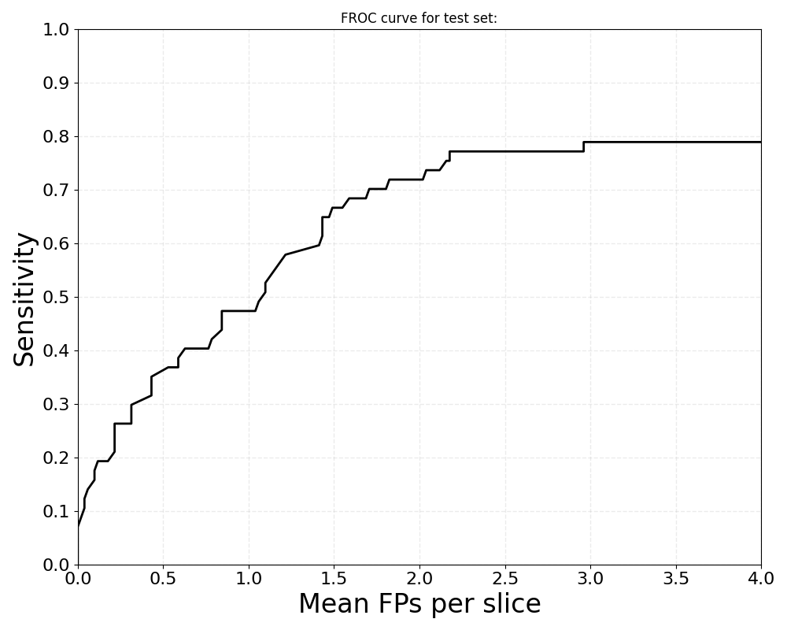
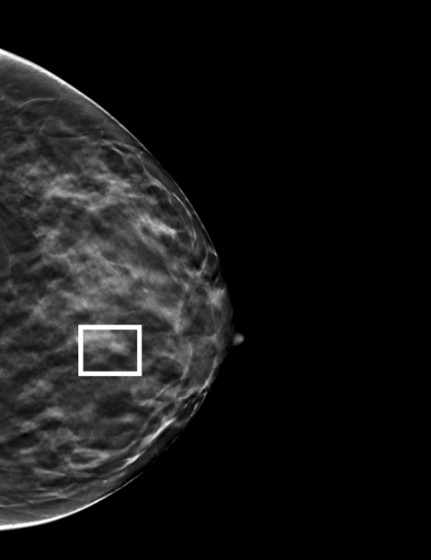
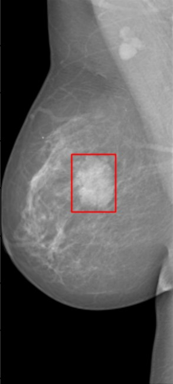
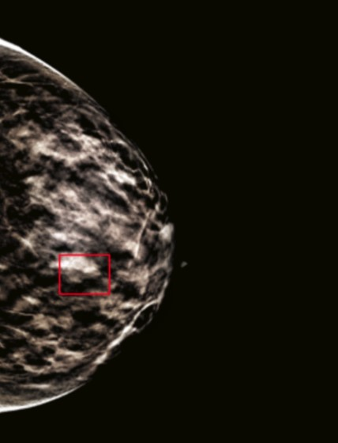
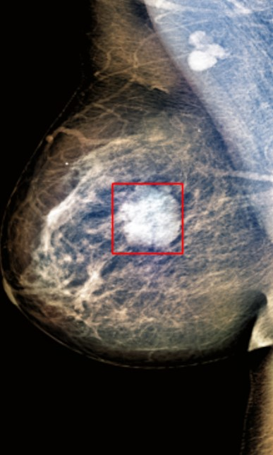

# Mass detection in Digital Breast Tomosynthesis Images

This is the code repository of my Diploma Thesis. The was not the original nor the only repository. The purpose of the creation of this repository was to present all the work from all the repositories and explain all in one place. In this specific repository the final files were uploaded for demonstration purposes. In this README file you can see a summary about the **image databases**, **model architectures** and **transfer learning techniques** that were selected for the final implemetations of the problem of _mass detection_. Here you can also see the **results** from all the presented implementations. Finally you can find the presentation file of my diploma thesis [here](https://github.com/charbitz/diploma-thesis/blob/main/presentation/Diploma%20Thesis%20Presentation.pptx).

## Image Databases:

* Digital Breast Tomosynthesis dataset published by Duke University, Durham, NC. You can find the dataset [here](https://www.cancerimagingarchive.net/collection/breast-cancer-screening-dbt/). This dataset consists of digital breast tomosynthesis images. Only 200 Biopsied case views and 234 Normal case views from this database were used. Biopsied cases have masses (benign or cancer) which were confirmed by radiologists by biopsy as dangerous. Normal cases have masses which do not correspond to dangerous findings, also confirmed by radiologists. The information was in the DICOM format so for the conversion of the images to the PNG format was implemented with the help of [this reposiroty](https://github.com/charbitz/dbt-data) 

* The famous INBreast dataset which can be found [here](https://www.kaggle.com/datasets/ramanathansp20/inbreast-dataset). The INBreast database was used because the size of DBT data was not enough. DBT data was difficult to find because it is a new medical imaging modality and so there were not so much data publicly available. This dataset consists of digital mammography images. Only 107 biopsied masses cases from this database were used. The groundtruth boxes were in Regions Of Interest information so the conversion to bounding boxes was implemented with the help of this [repository](https://github.com/charbitz/breast_mass_detection), which i forked and then commit changes for my implemetation. Also this repository was used for the conversion of the images from the DICOM format to PNG.

## Deep Learning Implementations:

### Apply a YOLO network in DenseNet architecture on DBT data.

The architecture of this model of this implementation was created by [duke-dbt-detection](https://github.com/mateuszbuda/duke-dbt-detection) and at this project it was used on a subset of the DBT data, with different tuning parameters and with different data augmentations.

Parameters of dataset splitting into subsets:
- training: 50%, validation: 20%, test: 10%
- splitting based on patients, in order not to have two different views of the same patient's mass in two different sets. The aim of this was to ensure that all subsets remained independent.

Hyper-parameter tuning:
- epochs
- patience : specifies how long in epochs the model should wait for an improvement in validation TPR2 metric, before ReduceLROnPlateau() function to be used.
- initial learning rate
- validation interval : the frequency in epochs at which the model evaluates its performance on the validation dataset
- schedule patience :  in ReduceLROnPlateau() function refers to the number of epochs with no improvement after which the learning rate will be reduced
- factor of learning rate: in ReduceLROnPlateau() function determines by how much the learning rate will be reduced.

Preprocessing in order to prepare the dataset:
- image downscaling
- image segmentation
- getting largest connected component

Data augmentations while training the YOLO model in DenseNet architecture:
- random scaling in [0.9 1.3]
- random area cropping with a way that contains though the ground truth bounding box, final fixed image dimensions: (1056, 672)
- random horrizontal flipping with a probability of 50%

#### Tuning performance criteria:
* True Positive Rate (Sensitivity) at 2 False Positives (at mean) per image (TPR2).
* Performance of the model (TPR2) in test set should closely align with that in validation set.
* As little flunctuations in TPR per epoch as possible.

### Apply a YOLOv5 network on DBT and INBreast data.

The YOLOv5 network is implemented by [ultralytics](https://www.ultralytics.com/). The documentation of YOLOv5 and the under development code can be found [here](https://github.com/ultralytics/yolov5). 

Apply preprocessing on both image databases in order to get better model performance:

- gaussian filtering
- image segmentation using OTSU thresholding
- getting largest connected component 
- truncation normalization
- Contrast Limited Adaptive Histogram Equalization
- image synthesizing into RGB format

Data augmentations while training the YOLOv5 model:
- random image translation of 20%
- random horrizontal flipping with a probability of 50%
- random vertical flipping with a probability of 50%

#### Tuning performance criteria:
* mAP (Mean Average Precision).
* Performance of the model (mAP50-95) in test set should closely align with that in validation set.
* mAP50-95: the average precision is calculated over multiple IoU thresholds, in steps of 0.05 (0.50, 0.55, 0.60, ..., 0.95).

### Apply transfer learning techniques on YOLOv5 model:

Technique 1: 
Pretraining YOLOv5 on INBreast data and then use YOLOv5 with the best weights on DBT data.

Technique 2:
Using all INBreast and part of DBT data on training set and then using the rest of DBT data on validation and test sets.

#### Tuning performance criteria:
* mAP (Mean Average Precision).
* Performance of the model (mAP50-95) in test set should closely align with that in validation set.
* mAP50-95: the average precision is calculated over multiple IoU thresholds, in steps of 0.05 (0.50, 0.55, 0.60, ..., 0.95).

## File Description:

Files for training YOLO network in DenseNet architecture on DBT data:
- [dense_yolo.py](https://github.com/charbitz/diploma-thesis/blob/main/dense_yolo.py)
- [dataset.py](https://github.com/charbitz/diploma-thesis/blob/main/dataset.py)
- [loss.py](https://github.com/charbitz/diploma-thesis/blob/main/loss.py)
- [preprocess.py](https://github.com/charbitz/diploma-thesis/blob/main/preprocess.py)
- [transform.py](https://github.com/charbitz/diploma-thesis/blob/main/transform.py)
- [sampler.py ](https://github.com/charbitz/diploma-thesis/blob/main/sampler.py)
- [subsets_split.py](https://github.com/charbitz/diploma-thesis/blob/main/subsets_split.py)
- [train_best_model.py](https://github.com/charbitz/diploma-thesis/blob/main/train_best_model.py)

### Files for creating DBT and INBreast datasets in YOLOv5 annotation format:

For cases with only biopsied masses:
- [reorganize_dataset_subsets_masses.py](https://github.com/charbitz/diploma-thesis/blob/main/reorganize_dataset_subsets_masses.py)
- [dbt_dataset_ONLY-BIOPSIED_masses_NO-CLASSES.yaml](https://github.com/charbitz/diploma-thesis/blob/main/dbt_dataset_ONLY-BIOPSIED_masses_NO-CLASSES.yaml)

For cases with both biopsied and normal masses:
- [reorganize_dataset_subsets_masses_multiple_slices_normal_10_perc.py](https://github.com/charbitz/diploma-thesis/blob/main/reorganize_dataset_subsets_masses_multiple_slices_normal_10_perc.py)
- [dbt_dataset_multiple_slices_masses_NO-CLASSES_WHOLE-NORMAL-10.yaml](https://github.com/charbitz/diploma-thesis/blob/main/dbt_dataset_multiple_slices_masses_NO-CLASSES_WHOLE-NORMAL-10.yaml)

## Results of Implementations:

### Results of DenseYOLO network:

Cases with only biopsied masses:

|                 | validation interval | schedule patience | factor | TPR2 validation | TPR2 test |
|:---------------:|:-------------------:|:-----------------:|:------:|:---------------:|:---------:|
| experiment 1    |         5           |        10         |  0.5   |       0.66      |  0.7192   |
| experiment 2    |         1           |        30         |  0.9   |       0.66      |  0.6666   |
| experiment 3    |         1           |        50         |  0.5   |       0.624     |  0.6666   |
| experiment 4    |         1           |        50         |  0.5   |       0.64      |  0.6596   |
| experiment 5    |         5           |        10         |  0.1   |       0.638     |  0.6491   |
| experiment 6    |         1           |        50         |  0.3   |       0.6511    |  0.6257   |
| experiment 7    |         1           |        30         |  0.4   |       0.6       |  0.5964   |
| experiment 8    |         5           |        10         |  0.3   |       0.58      |  0.5877   |   

Based on the above tuning performance criteria, the experiments with the best performance seem to be [**experiment 1**](https://github.com/charbitz/diploma-thesis/tree/main/data/mlruns/Exp_1) and [**experiment 4**](https://github.com/charbitz/diploma-thesis/tree/main/data/mlruns/Exp_4).

[Here](https://github.com/charbitz/diploma-thesis/tree/main/data/mlruns) you can find the tuning results of all the above experiments in cases with only biopsied masses. For each experiment you can find artifacts like training graphs, some metrics and training params and also the weights of the DenseYolo model that correspond to the best tuning.

For example for experiment 1:
 TPR of validation set: | TPR of test set: 
:-------------------------:|:-------------------------:
   |  

<h3 align="center">TPR2 of training set and TPR2 of validation set per epoch:</h3>

  

Cases with both biopsied and normal masses:

|                 | validation interval | schedule patience | factor | TPR2 validation | TPR2 test |
|:---------------:|:-------------------:|:-----------------:|:------:|:---------------:|:---------:|
| experiment 9    |         5           |        10         |  0.5   |       0.44      |  0.3684   |
| experiment 10   |         1           |        30         |  0.9   |       0.66      |  0.5748   |
| experiment 11   |         1           |        50         |  0.5   |       0.66      |  0.4584   |
| experiment 12   |         1           |        50         |  0.5   |       0.6880    |  0.5748   |
| experiment 13   |         5           |        10         |  0.1   |       0.62      |  0.6052   |
| experiment 14   |         1           |        50         |  0.3   |       0.66      |  0.5789   |
| experiment 15   |         1           |        30         |  0.4   |       0.7       |  0.5438   |
| experiment 16   |         5           |        10         |  0.3   |       0.59      |  0.52     |   

Based on the above tuning performance criteria, the experiments with the best performance seem to be **experiment 12**, **experiment 13** and **experiment 14**.

### Results of YOLOv5 network:

Images with preprocessing:

|                                  | mAP50 validation | mAP50 test | mAP50-95 validation | mAP50-95 test |
|:--------------------------------:|:----------------:|:----------:|:-------------------:|:-------------:|
| DBT                              |       0.414      |    0.372   |        0.191        |     0.141     |
| TF no. 1: pretrained on INbreast |       0.409      |    0.361   |        0.178        |     0.133     |
| TF no. 2: INbreast in train set  |       0.429      |    0.266   |        0.177        |     0.108     |

Images without preprocessing:

|                                  | mAP50 validation | mAP50 test | mAP50-95 validation | mAP50-95 test |
|:--------------------------------:|:----------------:|:----------:|:-------------------:|:-------------:|
| DBT                              |       0.434      |   0.441    |        0.176        |     0.188     |
| TF no. 1: pretrained on INbreast |       0.368      |   0.452    |        0.17         |     0.185     |
| TF no. 2: INbreast in train set  |       0.458      |   0.395    |        0.204        |     0.185     |

While transfer learning is a method that could potentially lead to improved outcomes, it did not prove to be effective in this case.

The masses in the INbreast images were more distinct, so the network had learned
to extract features and detect distinct masses and when asked to identify
masses from DBT images that had an extra difficulty because of the dense tissue, it didn't make much difference what knowledge the network had already learned.

For the same reason the training of the
YOLOv5, augmented with INbreast data in the training set, did not help
as the network in this case was learning two kinds of features together,
those of the INbreast data and those of the DBT data and this case since
the two kinds of features were different, it was no different from having only
DBT data.

  DBT image no PP: | INBreast image no PP:

   | 

  DBT image PP: | INBreast image PP:

   | 

## Attribution:

So finally this project includes code from the following repositories:
- [duke-dbt-data](https://github.com/mazurowski-lab/duke-dbt-data) by [mateuszbuda](https://github.com/mateuszbuda)
- [duke-dbt-detection](https://github.com/mateuszbuda/duke-dbt-detection) by [mateuszbuda](https://github.com/mateuszbuda)
- [yolov5](https://github.com/ultralytics/yolov5) by [ultralytics](https://github.com/ultralytics)
- [breast_mass_detection](https://github.com/jordanvaneetveldt/breast_mass_detection) by [jordanvaneetveldt](https://github.com/jordanvaneetveldt)
